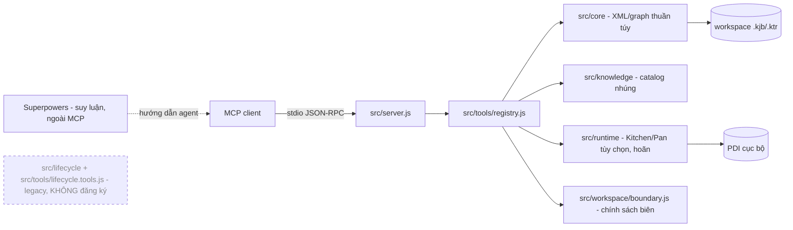

# pentaho-mcp-server

MCP stdio server cho file Pentaho Kettle `.kjb` và `.ktr`: kiểm tra/chỉnh sửa XML ít mất mát, tri thức Pentaho nhúng, và validation tĩnh. Tính năng lõi **không yêu cầu PDI**.

Đây là bản refactor của kettle-mcp “thin” (chỉnh sửa span-based, parse XML không mất mát), tổ chức thành các lớp lõi/tri thức/runtime và đóng gói để knowledge base đi kèm server. Cài package là có knowledge. Việc suy luận (brainstorm, duyệt thiết kế, đặc tả, lập kế hoạch) do **Superpowers** đảm nhận bên ngoài MCP; MCP chỉ cung cấp các tool nguyên thủy deterministic.

## Khả năng

Bề mặt production đúng **22 tool**, chia 5 nhóm:

| Nhóm | Số lượng | Tool |
|------|----------|------|
| Read | 4 | `kettle_list`, `kettle_summary`, `kettle_get_element`, `kettle_search` |
| Edit | 9 | `kettle_create_file`, `kettle_add_element`, `kettle_set_field`, `kettle_set_field_path`, `kettle_set_fields`, `kettle_edit_hops`, `kettle_add_error_hop`, `kettle_rename_element`, `kettle_clone` |
| Validate | 1 | `kettle_validate` |
| Knowledge | 4 | `kettle_knowledge_list`, `kettle_knowledge_get`, `kettle_knowledge_analyze_xml`, `kettle_knowledge_coverage` |
| Runtime (PDI tùy chọn, hoãn) | 4 | `kettle_runtime_detect`, `kettle_runtime_loadcheck`, `kettle_runtime_execute`, `kettle_runtime_logs` |

Nhóm Runtime tạm giữ lại nhưng **nằm ngoài workflow mới** và được hoãn cho một đợt refactor sau. MCP **không quảng bá bất kỳ prompt hay resource nào**; `initialize` chỉ khai báo `capabilities = { tools: {} }`.

Chi tiết đầy đủ xem `docs/tools-reference.md`.

## Không làm (non-goals)

- Server **không deploy** và không thay đổi Git (không commit/push/amend). Quyết định commit thuộc về bạn.
- Production knowledge **bất biến, chỉ đọc**; không có tool learning/promotion tại runtime.
- Validation gồm hai lớp: structural (lỗi làm Kettle không load/chạy được) và catalog (warning/info về độ phủ tri thức). Server **không** kiểm chứng đúng đắn nghiệp vụ/dữ liệu.
- Thực thi Kitchen/Pan và sinh testcase tự động **nằm ngoài workflow này** và được hoãn để hardening sau. Ranh giới hoàn tất là validation tĩnh (`kettle_validate` zero structural error cho từng artifact và toàn cây).

## Workflow khuyến nghị

Superpowers là workflow suy luận **được khuyến nghị**, nhưng các tool MCP nguyên thủy vẫn **gọi trực tiếp được** bởi client khác. Luồng end-to-end:


Nguyên tắc knowledge-first: gọi `kettle_knowledge_get(kind, type)` trước khi thêm/cấu hình mỗi type; ranh giới hoàn tất là validation tĩnh.

## Companion skill

Skill đi kèm nằm ở `skills/developing-pentaho-jobs/SKILL.md` (cùng `references/pentaho-spec-template.md`). Skill được đưa vào `files` của npm package (mục `"skills"`) và copy vào ZIP release Windows. Một agent tương thích Superpowers phát hiện skill bằng cách quét thư mục `skills/`; ở bản packaged, skill nằm trong ZIP giải nén dưới `skills/developing-pentaho-jobs/`.

## Bắt đầu nhanh

Yêu cầu: Node.js 20+. Ba runtime dependency: `@modelcontextprotocol/sdk`, `fast-xml-parser`, `yaml`.

### Chế độ source (cho developer)

```powershell
npm install
$env:KETTLE_ROOT = "C:\path\to\your\workspace"
node src/index.js
```

Đăng ký vào Kiro (`%USERPROFILE%\.kiro\settings\mcp.json`):

```json
{
  "mcpServers": {
    "dte-pentaho": {
      "command": "node",
      "args": ["C:/path/to/pentaho-mcp-server/src/index.js"],
      "env": { "KETTLE_ROOT": "C:/path/to/your/workspace" }
    }
  }
}
```

Kiểm tra:

```powershell
node --test
node scripts/verify-production-profile.mjs
```

Chuẩn mực thành công: toàn bộ suite pass và `production profile OK: 22 tools, no lifecycle prompt/resource surface, no learning/promotion surface`.

### Bản Windows tự chứa (cho end user)

Không cần system Node hay `npm install`; knowledge và companion skill nằm trong bản phát hành.

```powershell
npm run build:release -- --version 1.0.0
.\install.ps1 -WorkspaceRoot C:\path\to\your\workspace
.\doctor.ps1 -WorkspaceRoot C:\path\to\your\workspace
```

Gỡ bỏ: `.\uninstall.ps1` (chỉ xóa entry `dte-pentaho`).

Hướng dẫn chi tiết: `docs/install.md` (cài đặt), `docs/configuration.md` (`KETTLE_ROOT`, biên workspace, PDI tùy chọn/hoãn), `docs/operations.md` (vận hành).

## Kiến trúc tóm tắt



Superpowers nằm **ngoài** MCP. Module lifecycle cũ (`src/lifecycle/**`, `src/tools/lifecycle.tools.js`) còn trên đĩa nhưng **không đăng ký** vào `FACTORIES` (legacy, giữ để rollback/trích xuất sau). `KETTLE_ROOT` mặc định là `process.cwd()` khi unset và **luôn được enforce** (canonical containment) qua `src/workspace/boundary.js`.

Luồng chi tiết, module map, và quy ước lỗi/kết quả xem `docs/architecture.md`. Playbook idea-to-static-job xem `docs/workflow-guide.md`.

## Cấu hình tối thiểu

- `KETTLE_ROOT` mặc định `process.cwd()` khi unset và luôn được enforce: đường dẫn tuyệt đối chỉ hợp lệ khi nằm trong root; `..`, sibling-prefix và symlink/junction thoát root đều bị từ chối.
- `.pentaho-mcp.yaml` chỉ còn liên quan tới các tool runtime tùy chọn/đã hoãn.

Chi tiết xem `docs/configuration.md`.

## Tài liệu

| Tài liệu | Đối tượng |
|----------|-----------|
| `docs/architecture.md` | Kiến trúc hệ thống, module, luồng MCP, biên an toàn |
| `docs/configuration.md` | `KETTLE_ROOT` và biên workspace, biến môi trường, runtime tùy chọn/hoãn |
| `docs/tools-reference.md` | Catalog 22 tool: tham số, output, ví dụ, bảng chọn tool |
| `docs/workflow-guide.md` | Workflow idea-to-static-job và hợp đồng đặc tả |
| `docs/development.md` | Setup repo, test, thêm tool/type, build release, checklist đóng góp |
| `docs/operations.md` | Triển khai, verify, upgrade/rollback, `doctor.ps1`, log, sự cố |
| `docs/install.md` | Quy trình cài đặt source-mode và packaged-mode |

Bảng truy xuất nguồn-sự thật cho người rà soát: `docs/documentation-facts.md`.

## Phát triển

```powershell
npm install
node --test
node scripts/verify-production-profile.mjs
```

Thêm step/entry type mới không cần code (chỉ `catalog.yaml` + Markdown); thêm tool mới chỉ cần factory `src/tools/*.tools.js` + đăng ký trong `registry.js`. Chi tiết xem `docs/development.md`.
