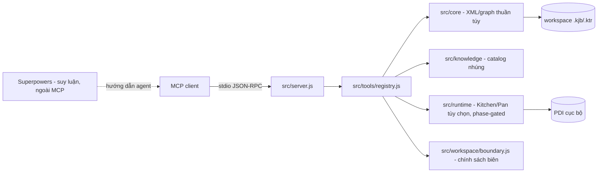

# pentaho-mcp-server

MCP stdio server cho file Pentaho Kettle `.kjb` và `.ktr`: kiểm tra/chỉnh sửa XML ít mất mát, tri thức Pentaho nhúng, và validation tĩnh. Tính năng lõi **không yêu cầu PDI**.

Đây là bản refactor của kettle-mcp “thin” (chỉnh sửa span-based, parse XML không mất mát), tổ chức thành các lớp lõi/tri thức/runtime và đóng gói để knowledge base đi kèm server. Cài package là có knowledge. Việc suy luận (brainstorm, duyệt thiết kế, đặc tả, lập kế hoạch) do **Superpowers** đảm nhận bên ngoài MCP; MCP chỉ cung cấp các tool nguyên thủy deterministic.

## Khả năng

Bề mặt production đúng **26 tool**, chia 6 nhóm:

| Nhóm | Số lượng | Tool |
|------|----------|------|
| Read | 4 | `kettle_list`, `kettle_summary`, `kettle_get_element`, `kettle_search` |
| Edit | 9 | `kettle_create_file`, `kettle_add_element`, `kettle_set_field`, `kettle_set_field_path`, `kettle_set_fields`, `kettle_edit_hops`, `kettle_add_error_hop`, `kettle_rename_element`, `kettle_clone` |
| Artifact | 2 | `kettle_set_parameters`, `kettle_copy_connection` |
| Removal | 2 | `kettle_remove_element`, `kettle_edit_error_hop` |
| Validate | 1 | `kettle_validate` |
| Knowledge | 4 | `kettle_knowledge_list`, `kettle_knowledge_get`, `kettle_knowledge_analyze_xml`, `kettle_knowledge_coverage` |
| Runtime (PDI tùy chọn, phase-gated) | 4 | `kettle_runtime_detect`, `kettle_runtime_loadcheck`, `kettle_runtime_execute`, `kettle_runtime_logs` |

Nhóm **Artifact** sửa tham số cấp artifact (`kettle_set_parameters`) và sao chép một `<connection>` đã đặt tên giữa các artifact trong root (`kettle_copy_connection`), **không bao giờ** ghi mật khẩu dạng plaintext (chỉ cho phép rỗng, `${BIẾN}`, hoặc chuỗi `Encrypted...` khi bật `allowEncryptedPassword`). Nhóm **Removal** xóa step/entry an toàn theo tham chiếu (`kettle_remove_element`, mặc định từ chối khi còn tham chiếu; `removeReferences:true` để cascade) và bật/tắt/xóa error hop (`kettle_edit_error_hop`).

Nhóm Runtime **thuộc workflow** nhưng bị **giới hạn theo pha** (phase-gated): chỉ dùng sau khi validation tĩnh pass; `kettle_runtime_execute` còn cần user duyệt riêng cho lần chạy đó và `confirmed: true`. Chi tiết xem `docs/workflow-guide.md`. MCP **không quảng bá bất kỳ prompt hay resource nào**; `initialize` chỉ khai báo `capabilities = { tools: {} }`.

Chi tiết đầy đủ xem `docs/tools-reference.md`.

## Không làm (non-goals)

- Server **không deploy** và không thay đổi Git (không commit/push/amend). Quyết định commit thuộc về bạn.
- Production knowledge **bất biến, chỉ đọc**; không có tool learning/promotion tại runtime.
- Validation gồm hai lớp: structural (lỗi làm Kettle không load/chạy được) và catalog (warning/info về độ phủ tri thức). Server **không** kiểm chứng đúng đắn nghiệp vụ/dữ liệu.
- Thực thi Kitchen/Pan là bước verification **phase-gated** trong workflow (chỉ sau validation tĩnh, execute cần user duyệt), **không** phải bước build. Ranh giới hoàn tất của phần build là validation tĩnh (`kettle_validate` zero structural error cho từng artifact và toàn cây). Sinh testcase tự động và truy cập database nằm ngoài workflow.

## Workflow khuyến nghị

Superpowers là workflow suy luận **được khuyến nghị**, nhưng các tool MCP nguyên thủy vẫn **gọi trực tiếp được** bởi client khác. Luồng end-to-end năm pha:


**Cổng mutation:** không tool edit MCP nào chạy cho tới khi **cả** đặc tả viết ra **và** kế hoạch triển khai được duyệt rõ ràng (duyệt thiết kế đơn thuần chưa đủ). Knowledge-first: gọi `kettle_knowledge_get(kind, type)` trước khi thêm/cấu hình mỗi type. Runtime phase-gated: `loadcheck` chỉ sau validation tĩnh; `execute` cần thêm user duyệt và `confirmed: true`.

## Companion skill

Skill đi kèm nằm ở `skills/developing-pentaho-jobs/SKILL.md`, cùng hai mẫu tham chiếu `references/pentaho-spec-template.md` và `references/pentaho-plan-template.md`. Skill được đưa vào `files` của npm package (mục `"skills"`) và copy vào ZIP release Windows.

**Phát hiện skill (discovery) không tự động chỉ vì `skills/` nằm trong ZIP.** Cách nạp tùy client:

- **Kiro:** copy thư mục `skills/developing-pentaho-jobs/` vào `.kiro/skills/` của workspace (hoặc `~/.kiro/skills/` cho phạm vi user), rồi Kiro sẽ khám phá được skill.
- **Codex / agent tương thích Superpowers dùng alias chung:** đặt skill dưới thư mục skills của runtime đó (ví dụ `~/.agents/skills/`) hoặc thư mục skills mà runtime quét; xem tài liệu client để biết đường dẫn chính xác.

Ở bản packaged, skill nằm trong ZIP giải nén dưới `skills/developing-pentaho-jobs/`; bạn vẫn cần copy vào vị trí skills của client như trên.

## Bắt đầu nhanh

Yêu cầu: Node.js 20+. Hai runtime dependency: `@modelcontextprotocol/sdk`, `fast-xml-parser`.

### Chế độ source (cho developer)

```powershell
npm install
$env:KETTLE_ROOT = "C:\path\to\your\workspace"
node src/index.js
```

Đăng ký vào Kiro (`%USERPROFILE%\.kiro\settings\mcp.json`):

```json
{
  "mcpServers": {
    "dte-pentaho": {
      "command": "node",
      "args": ["C:/path/to/pentaho-mcp-server/src/index.js"],
      "env": {
        "KETTLE_ROOT": "C:/path/to/your/workspace",
        "PENTAHO_HOME": "C:/Pentaho/data-integration"
      }
    }
  }
}
```

`KETTLE_ROOT` là tùy chọn nhưng nên đặt khi không chắc thư mục làm việc của tiến trình MCP. `PENTAHO_HOME` chỉ cần khi dùng nhóm runtime tùy chọn.

Kiểm tra:

```powershell
node --test
node scripts/verify-production-profile.mjs
```

Chuẩn mực thành công: toàn bộ suite pass và `production profile OK: 26 tools (exact set), no lifecycle prompt/resource surface, no learning/promotion surface`.

### Bản Windows tự chứa (cho end user)

Không cần system Node hay `npm install`; knowledge và companion skill nằm trong bản phát hành.

```powershell
npm run build:release -- --version 1.0.0
.\install.ps1 -WorkspaceRoot C:\path\to\your\workspace -PentahoHome C:\Pentaho\data-integration
.\doctor.ps1 -PentahoHome C:\Pentaho\data-integration
```

Gỡ bỏ: `.\uninstall.ps1` (chỉ xóa entry `dte-pentaho`).

Hướng dẫn chi tiết: `docs/install.md` (cài đặt), `docs/configuration.md` (`KETTLE_ROOT`, biên workspace, `PENTAHO_HOME` runtime tùy chọn), `docs/operations.md` (vận hành).

## Kiến trúc tóm tắt



Superpowers nằm **ngoài** MCP. Bề mặt và phần cài đặt lifecycle BA đã được **gỡ bỏ** khỏi source; hồ sơ thiết kế lịch sử vẫn lưu tại `docs/superpowers/`. `KETTLE_ROOT` mặc định là `process.cwd()` khi unset và **luôn được enforce** (canonical containment) qua `src/workspace/boundary.js`.

Luồng chi tiết, module map, và quy ước lỗi/kết quả xem `docs/architecture.md`. Playbook workflow phát triển Pentaho năm pha xem `docs/workflow-guide.md`.

## Cấu hình tối thiểu

- `KETTLE_ROOT` mặc định `process.cwd()` khi unset và luôn được enforce: đường dẫn tuyệt đối chỉ hợp lệ khi nằm trong root; `..`, sibling-prefix và symlink/junction thoát root đều bị từ chối.
- `PENTAHO_HOME` là thiết lập vị trí PDI duy nhất, chỉ cần cho nhóm runtime tùy chọn; không còn file cấu hình YAML theo project.

Chi tiết xem `docs/configuration.md`.

## Tài liệu

| Tài liệu | Đối tượng |
|----------|-----------|
| `docs/architecture.md` | Kiến trúc hệ thống, module, luồng MCP, biên an toàn |
| `docs/configuration.md` | `KETTLE_ROOT` và biên workspace, biến môi trường, `PENTAHO_HOME` runtime tùy chọn |
| `docs/tools-reference.md` | Catalog 26 tool: tham số, output, ví dụ, bảng chọn tool |
| `docs/workflow-guide.md` | Workflow phát triển Pentaho năm pha, hợp đồng đặc tả, cổng mutation, runtime phase-gated |
| `docs/development.md` | Setup repo, test, thêm tool/type, build release, checklist đóng góp |
| `docs/operations.md` | Triển khai, verify, upgrade/rollback, `doctor.ps1`, log, sự cố |
| `docs/install.md` | Quy trình cài đặt source-mode và packaged-mode |

Bảng truy xuất nguồn-sự thật cho người rà soát: `docs/documentation-facts.md`.

## Phát triển

```powershell
npm install
node --test
node scripts/verify-production-profile.mjs
```

Thêm step/entry type mới không cần code (chỉ `catalog.yaml` + Markdown); thêm tool mới chỉ cần factory `src/tools/*.tools.js` + đăng ký trong `registry.js`. Chi tiết xem `docs/development.md`.
