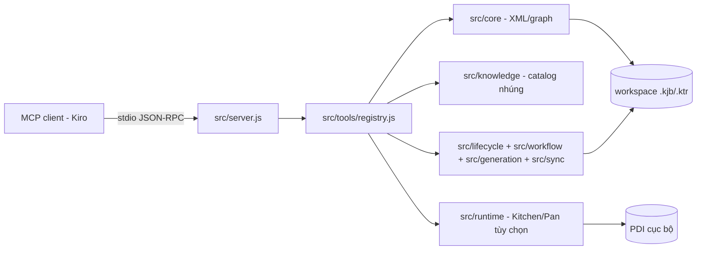
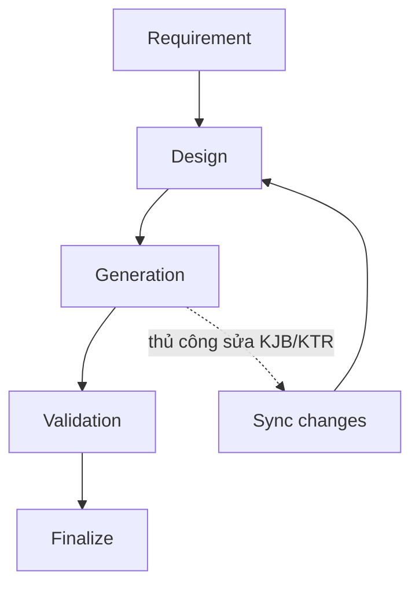

# pentaho-mcp-server

MCP stdio server cho file Pentaho Kettle `.kjb` và `.ktr`: kiểm tra/chỉnh sửa XML ít mất mát, tri thức Pentaho nhúng, sinh mã theo lifecycle, validation tĩnh, và thực thi PDI cục bộ có kiểm soát (tùy chọn). Tính năng lõi **không yêu cầu PDI**.

Đây là bản refactor của kettle-mcp “thin” (chỉnh sửa span-based, parse XML không mất mát), tổ chức thành các lớp lõi/tri thức/lifecycle/runtime và đóng gói để knowledge base đi kèm server. Cài package là có knowledge.

## Khả năng

Bề mặt production đúng **32 tool**, chia 6 nhóm:

| Nhóm | Số lượng | Tool |
|------|----------|------|
| Read | 4 | `kettle_list`, `kettle_summary`, `kettle_get_element`, `kettle_search` |
| Edit | 10 | `kettle_create_file`, `kettle_add_element`, `kettle_set_sql`, `kettle_set_field`, `kettle_set_field_path`, `kettle_set_fields`, `kettle_edit_hops`, `kettle_add_error_hop`, `kettle_rename_element`, `kettle_clone` |
| Validate | 1 | `kettle_validate` |
| Knowledge | 4 | `kettle_knowledge_list`, `kettle_knowledge_get`, `kettle_knowledge_analyze_xml`, `kettle_knowledge_coverage` |
| Lifecycle | 9 | `pentaho_project_inspect`, `pentaho_workflow_start`, `pentaho_workflow_status`, `pentaho_requirement_write`, `pentaho_design_write`, `pentaho_generate`, `pentaho_sync_changes`, `pentaho_validate_project`, `pentaho_finalize` |
| Runtime (PDI tùy chọn) | 4 | `kettle_runtime_detect`, `kettle_runtime_loadcheck`, `kettle_runtime_execute`, `kettle_runtime_logs` |

Ngoài ra có một MCP **prompt** `develop-pentaho-job` và 5 **resource** lifecycle chỉ đọc (`dte-pentaho://skills/...`) dẫn dắt agent Kiro qua workflow requirement → design → generate → validate có thể resume.

Chi tiết đầy đủ xem `docs/tools-reference.md`.

## Không làm (non-goals)

- Server **không deploy** và không thay đổi Git (không commit/push/amend); chỉ đọc `git status` khi inspect. Quyết định commit thuộc về bạn.
- Production knowledge **bất biến, chỉ đọc**; không có tool learning/promotion tại runtime.
- Validation gồm hai lớp: structural (lỗi làm Kettle không load/chạy được) và catalog (warning/info về độ phủ tri thức). Server **không** kiểm chứng đúng đắn nghiệp vụ/dữ liệu.
- Thực thi Kitchen/Pan là **tùy chọn, có kiểm soát**: chỉ tự chạy ở `DEV`/`TEST`; mọi môi trường khác (kể cả `UNKNOWN`) yêu cầu `confirmed: true`. Log được khử nhạy cảm.

## Bắt đầu nhanh

Yêu cầu: Node.js 20+. Ba runtime dependency: `@modelcontextprotocol/sdk`, `fast-xml-parser`, `yaml`.

### Chế độ source (cho developer)

```powershell
npm install
$env:KETTLE_ROOT = "C:\path\to\your\workspace"
node src/index.js
```

Đăng ký vào Kiro (`%USERPROFILE%\.kiro\settings\mcp.json`):

```json
{
  "mcpServers": {
    "dte-pentaho": {
      "command": "node",
      "args": ["C:/path/to/pentaho-mcp-server/src/index.js"],
      "env": { "KETTLE_ROOT": "C:/path/to/your/workspace" }
    }
  }
}
```

Kiểm tra:

```powershell
node --test
node scripts/verify-production-profile.mjs
```

Chuẩn mực thành công: toàn bộ suite pass và `production profile OK: 32 tools, 5 resources, 1 prompt(s), no learning/promotion surface`.

### Bản Windows tự chứa (cho end user)

Không cần system Node hay `npm install`; knowledge và lifecycle guidance nằm trong `.exe`.

```powershell
npm run build:release -- --version 1.0.0
.\install.ps1 -WorkspaceRoot C:\path\to\your\workspace
.\doctor.ps1 -WorkspaceRoot C:\path\to\your\workspace
```

Gỡ bỏ: `.\uninstall.ps1` (chỉ xóa entry `dte-pentaho`).

Hướng dẫn chi tiết: `docs/install.md` (cài đặt), `docs/configuration.md` (schema `.pentaho-mcp.yaml`, `KETTLE_ROOT`, PDI), `docs/operations.md` (vận hành).

## Kiến trúc tóm tắt





Luồng chi tiết, module map, và quy ước lỗi/kết quả xem `docs/architecture.md`. Playbook từng chặng xem `docs/workflow-guide.md`.

## Cấu hình tối thiểu

Mỗi workspace commit một `.pentaho-mcp.yaml` ở gốc. Mọi đường dẫn đều tương đối workspace; absolute/thoát workspace hoặc ghi vào `input/` đều bị từ chối.

```yaml
schema_version: 1
project:
  code: EXAMPLE
paths:
  requirements: docs
  pentaho: etl-pentaho
environment:
  name: UNKNOWN
pentaho:
  # home: pentaho-ce/data-integration
```

Schema đầy đủ và chính sách `DEV`/`TEST` xem `docs/configuration.md`.

## Tài liệu

| Tài liệu | Đối tượng |
|----------|-----------|
| `docs/architecture.md` | Kiến trúc hệ thống, module, luồng MCP, biên an toàn |
| `docs/configuration.md` | Schema `.pentaho-mcp.yaml`, biến môi trường, biên đọc/ghi, chính sách thực thi |
| `docs/tools-reference.md` | Catalog 32 tool: tham số, output, ví dụ, bảng chọn tool |
| `docs/workflow-guide.md` | Playbook lifecycle end-to-end cho operator và agent |
| `docs/development.md` | Setup repo, test, thêm tool/type, build release, checklist đóng góp |
| `docs/operations.md` | Triển khai, verify, upgrade/rollback, `doctor.ps1`, log, sự cố |
| `docs/install.md` | Quy trình cài đặt source-mode và packaged-mode |

Bảng truy xuất nguồn-sự thật cho người rà soát: `docs/documentation-facts.md`.

## Phát triển

```powershell
npm install
node --test
node scripts/verify-production-profile.mjs
```

Thêm step/entry type mới không cần code (chỉ `catalog.yaml` + Markdown); thêm tool mới chỉ cần factory `src/tools/*.tools.js` + đăng ký trong `registry.js`. Chi tiết xem `docs/development.md`.
