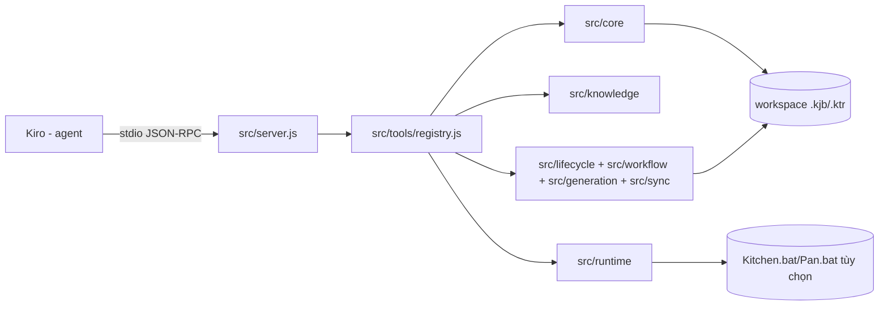
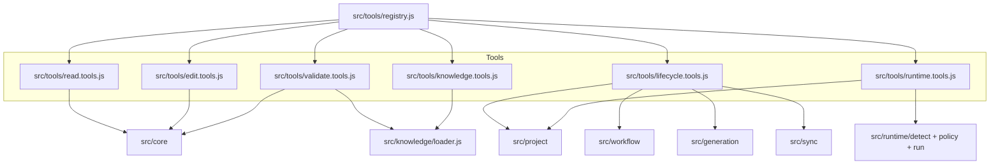
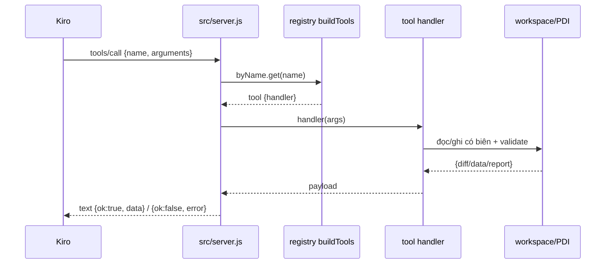
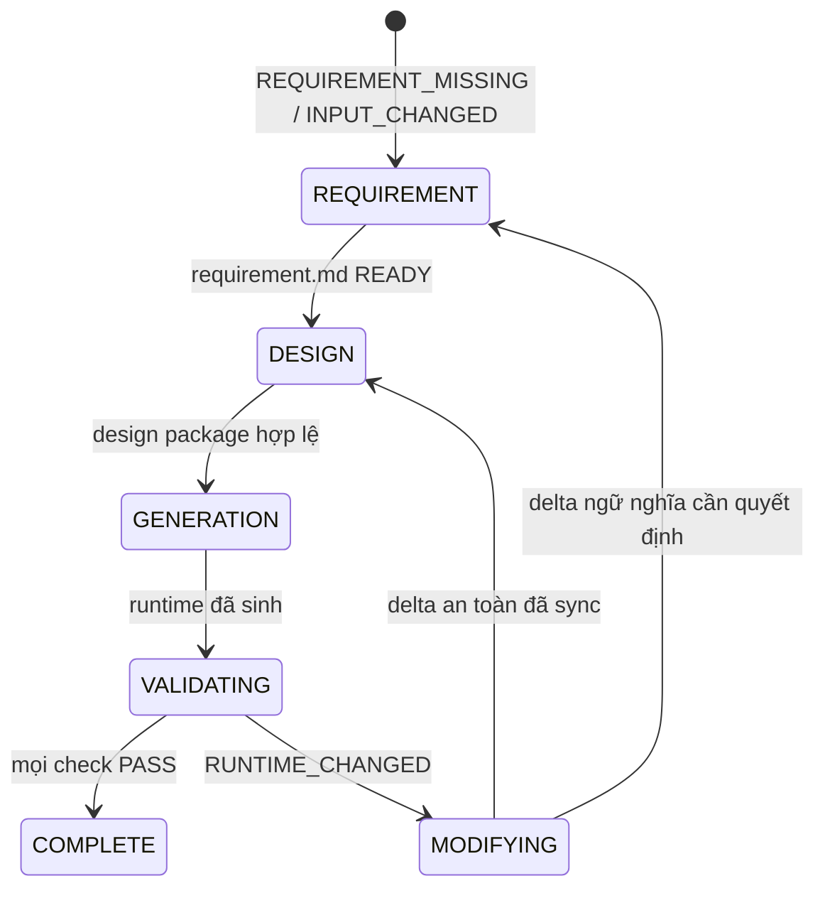

# Kiến trúc

Tài liệu khái niệm cho operator, maintainer và người dùng tool. Nguồn sự thật là `src/`, `test/`, `scripts/`, `packaging/`.

## Bối cảnh hệ thống

`pentaho-mcp-server` là MCP stdio server: Kiro (reasoning agent) gọi tool/prompt/resource qua stdio; server kiểm tra, chỉnh sửa, sinh và validate file `.kjb`/`.ktr` trong workspace, và (tùy chọn) nhờ PDI cục bộ load-check/execute. Server không deploy, không sửa Git.

## Nguyên tắc thiết kế

- Ba trục thay đổi, ba thư mục: `core/` hiếm đổi (engine XML/graph thuần túy, không biết type); `knowledge/` là dữ liệu (đổi thường xuyên, thêm type); `tools/` đổi khi thêm tính năng.
- Nguồn sự thật là XML thật đã kiểm chứng trong `src/knowledge/pentaho/`, không phải mapper code viết tay. Sửa sai nghĩa là sửa Markdown/XML reference.
- Validation nhắm “có load/chạy được không”, không nhắm đúng đắn dữ liệu.
- Production knowledge bất biến, chỉ đọc; không có learning/promotion tại runtime (`scripts/verify-production-profile.mjs` chặn).
- Mọi mutation lifecycle đều compare-and-swap bằng `expectedHashes`; state file chỉ là gợi ý, bytes hiện tại mới quyết định.

## Bản đồ module

| Module | Vai trò | Nguồn |
|--------|---------|-------|
| `src/server.js` | Wiring MCP: `ListTools`, `CallTool`, `ListPrompts/GetPrompt`, `ListResources/ReadResource`; envelope `{ok, data/error}` | `src/server.js` |
| `src/tools/registry.js` | `buildTools(ctx)` gộp 6 factory: read/edit/validate/knowledge/lifecycle/runtime; chặn trùng tên | `src/tools/registry.js` |
| `src/core/` | `model.js`, `span.js`, `edit.js`, `search.js`, `validate.js`, `summarize.js`, `knowledge-intake.js`, `knowledge-coverage.js` — engine thuần túy | `src/core/*.js` |
| `src/knowledge/` | `loader.js` (parse `catalog.yaml`, resolve reference, `KETTLE_KNOWLEDGE_DIR` override), `catalog-check.js` | `src/knowledge/loader.js` |
| `src/project/` | `config.js` (parse strict `.pentaho-mcp.yaml`), `paths.js` (containment, biên `input/`) | `src/project/*.js` |
| `src/workflow/` | `hash.js`, `state.js` (ghi atomic tmp+fsync+rename), `inspect.js` (phục hồi chặng), `lock.js` (lock advisory theo requirement) | `src/workflow/*.js` |
| `src/lifecycle/` | Prompt/resource catalog bất biến, `requirement-validator.js`, `design-loader.js`, `design-validator.js`, `diagram-renderer.js`, `artifact-write.js`, `finalize.js` + 5 Markdown guidance | `src/lifecycle/*` |
| `src/generation/` | `generate.js`, `job.js`, `transformation.js`, `infrastructure.js`, `validate-generation.js` — sinh deterministic từ design | `src/generation/*.js` |
| `src/sync/` | `diff-runtime-design.js`, `apply-design-delta.js`, `changelog.js` — so sánh runtime/design, patch YAML/design/diagram, prepend `CHG-NNN` | `src/sync/*.js` |
| `src/runtime/` | `detect.js`, `policy.js`, `run.js`, `redact.js` — dò PDI, chính sách thực thi, spawn có timeout, khử nhạy cảm | `src/runtime/*.js` |
| `scripts/`, `packaging/` | `build-release.mjs` (esbuild + SEA + postject + ZIP), `verify-production-profile.mjs`, `install.ps1`/`uninstall.ps1`/`doctor.ps1` | `scripts/*`, `packaging/*` |

## Luồng request/response MCP

Tool failure là payload model đọc được, không phải protocol error. Edit tool trả unified diff của đúng bytes đã đổi; validate trước khi commit nơi áp dụng được.

## Mô hình XML và chỉnh sửa span-based

- Parse bằng `fast-xml-parser` với `XMLValidator` trước; trích bytes gốc bằng `findAllSpans` để giữ thứ tự field, CRLF, và khác biệt serialization không liên quan.
- `addElement` tra catalog trước cả khi có `templateXml` (chặn bypass custom template); `observed` cần `allowObserved: true` và prefix đúng một marker `<!-- MANUAL_REVIEW: ... -->`, trả `{diff, catalogStatus, manualReviewRequired}`.
- `setSql`/`setField`/`setFieldPath`/`setFields` phẫu thuật đúng node; `editHops` giữ ngữ nghĩa job hop (`evaluation`, `unconditional`, auto-`unconditional=Y` từ START); `kettle_add_error_hop` ghi cả block `<error>` trong `<step_error_handling>` và hop thường trong một edit atomic (chỉ transformation).
- `createFile`/`cloneFile` từ chối ghi đè; mọi đường ghi đều qua `assertInsideRoots`.

## Tri thức: nạp catalog và eligibility

- `catalog.yaml` là inventory duy nhất. `loader.js` parse shape hẹp (scalar top-level, block `policy:`, list inline flow-map), hỗ trợ `KETTLE_KNOWLEDGE_DIR` override; `listTypes`/`findByXmlType`/`knownXmlTypes`/`getReference`/`isGeneratorEligible` là API duy nhất.
- Policy: `canonical` + `generator_eligible: true` mới scaffold sạch; `observed` cần opt-in + marker; unknown luôn bị scaffolding từ chối cho tới khi intake có tài liệu.
- `kettle_knowledge_analyze_xml` chỉ đọc: bọc block đơn trong document tối thiểu trong bộ nhớ để parse model, giữ bytes gốc, trả candidate + findings (`ABSOLUTE_PATH`, `POSSIBLE_SECRET`, …), không ghi/promote.
- `kettle_knowledge_coverage` duyệt `walkKettleFiles`, chỉ đếm `model.elements` (bỏ field lồng `<type>String</type>`), key `${kind}\0${type}`, sắp xếp missing → observed → canonical rồi usage desc, resilient trước file hỏng.

## Lifecycle: phục hồi trạng thái

State ghi atomic (`workflow-state.yaml.tmp`, fsync/close, rename), chứa schema version, MCP version, input hash, artifact hashes/revisions, current/last-completed stage, timestamp, validation summary. Không bao giờ coi state mạnh hơn bytes hiện tại.

`inspectWorkflow` kiểm kê input/docs/design YAML/changelog/runtime khai báo/Git diff read-only; `decideNextStage` resume chặng cũ nhất stale/khuyết, chỉ trả `USER_DECISION_REQUIRED` khi divergent không thể hòa giải. Lock theo requirement (`.pentaho-workflow.lock`, PID/session/timestamp, refresh khi mutation, phục hồi stale sau tái kiểm tra, luôn release trong `finally`).

## Validation design và sinh deterministic

- Requirement: parse front matter + bảng Markdown, đủ 10 section artifact, reference nguồn/yêu cầu, open-question nhất quán, zero blocking question mới `READY`; readiness kỹ thuật thay cho handoff con người.
- Design: `yaml.parseAllDocuments`, một mapping mỗi file, resolve component an toàn, validate ID/hop/reference/type/traceability/secret; `renderDesignDiagrams` chỉ cập nhật vùng diagram generated đã đánh dấu; `manifest.yaml` + `design.md` bắt buộc.
- Generation: `planGeneration` (no-write) nạp mọi catalog reference trước, từ chối type vắng, yêu cầu known-gap decision cho observed (đúng một `MANUAL_REVIEW`), từ chối thư mục đích non-empty unmanaged, tính full inventory; sinh job/transformation từ template catalog + helper XML, dịch đúng giá trị trong design YAML; infrastructure sinh shared connection variable-only, properties, launcher, DDL/advisory tùy chọn, changelog khởi tạo; `validateGeneration` kiểm counts, internal name, reference, graph, field, SQL, secret, absolute path, placeholder trước khi promote output tạm.

## Đối chiếu runtime/design

`diffRuntimeDesign` dùng model Kettle + catalog mapping, so tên/type/cấu hình trọng yếu/SQL/field/topology, bỏ qua tọa độ và serialization nhiễu, trả path ổn định + old/new. `applyDesignDelta` patch đúng node YAML, regen block diagram ảnh hưởng, tăng design revision một lần, prepend một `CHG-NNN` append-only; chỉ chạm requirement khi caller cung cấp business change có evidence.

## Runtime PDI tùy chọn

`detectPdi` resolve `Kitchen.bat`/`Pan.bat` dưới PDI home, probe help/version bằng argument array `shell: false` (trừ Windows `.bat` phải qua shell có quote), cache theo home/version, phân biệt unavailable vs failed. `runPdi` validation tĩnh trước, loadcheck dùng list/load behavior theo version PDI, execute chỉ khi policy cho phép, giới hạn cwd/tham số/env/output/timeout, log khử nhạy cảm trong workflow (`runtime-logs/`).

## Quy ước lỗi/kết quả

`{ "ok": true, "data": ... }` hoặc `{ "ok": false, "error": "..." }` trong `text` content. Ghi lifecycle trả per-file diff + hash mới; hash stale → `CONCURRENT_CHANGE` không ghi; generation thất bại để lại output chẩn đoán đánh dấu incomplete; finalize tổng hợp requirement/design/generation/Kettle tĩnh/reconciliation/PDI load/execution mà không gộp `NOT_RUN` thành pass.

## Biên an toàn

- Đường ghi giới hạn trong `paths.requirements`/`paths.pentaho`; chặn absolute/escape, chặn ghi `input/`, chặn `dte-*` hard-code (đọc từ YAML).
- Thực thi chỉ `DEV`/`TEST` auto; còn lại cần confirm; spawn giới hạn, output 256KB, timeout mặc định 120s, redaction credential/tham số nhạy cảm.
- Git chỉ đọc; không commit/push/amend.

## Non-goals có chủ ý

Không Carte REST, không monorepo/docs app, không per-type schema registry, không kiểm chứng nghiệp vụ/dữ liệu, không approval gate con người cho readiness, không promotion tri thức tại runtime.
