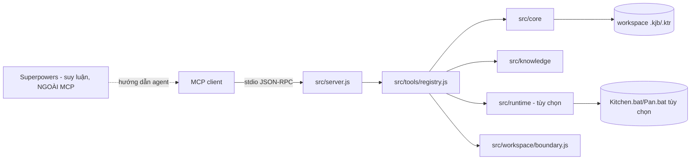
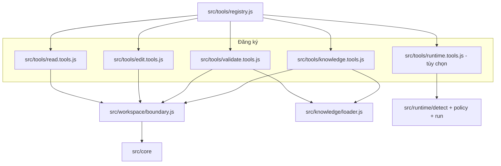
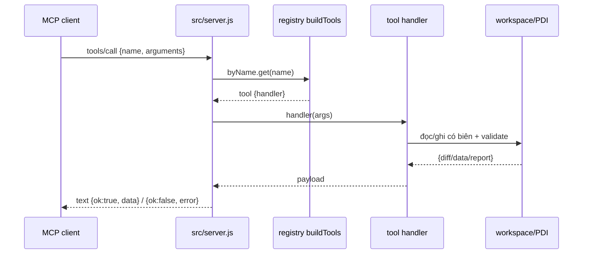

# Kiến trúc

Tài liệu khái niệm cho operator, maintainer và người dùng tool. Nguồn sự thật là `src/`, `test/`, `scripts/`, `packaging/`.

## Bối cảnh hệ thống

`pentaho-mcp-server` là MCP stdio server: client gọi **tool** qua stdio; server kiểm tra, chỉnh sửa và validate file `.kjb`/`.ktr` trong workspace, và (tùy chọn, đã hoãn) nhờ PDI cục bộ load-check/execute. Server không quảng bá prompt/resource, không deploy, không sửa Git.

Việc suy luận — brainstorming, duyệt thiết kế, đặc tả, lập kế hoạch — do **Superpowers** đảm nhận **bên ngoài** MCP. MCP chỉ cung cấp các tool nguyên thủy deterministic; các tool này vẫn gọi trực tiếp được bởi client khác.

Phần cài đặt lifecycle BA cũ đã được **gỡ bỏ khỏi source**; không còn module nào như vậy trên đĩa. Hồ sơ thiết kế lịch sử chỉ còn dưới `docs/superpowers/`.

## Nguyên tắc thiết kế

- Ba trục thay đổi, ba thư mục: `core/` hiếm đổi (engine XML/graph thuần túy, không biết type); `knowledge/` là dữ liệu (đổi thường xuyên, thêm type); `tools/` đổi khi thêm tính năng.
- Nguồn sự thật là XML thật đã kiểm chứng trong `src/knowledge/pentaho/`, không phải mapper code viết tay. Sửa sai nghĩa là sửa Markdown/XML reference.
- Validation nhắm “có load/chạy được không”, không nhắm đúng đắn dữ liệu.
- Production knowledge bất biến, chỉ đọc; không có learning/promotion tại runtime (`scripts/verify-production-profile.mjs` chặn).
- Biên workspace là một chính sách chia sẻ duy nhất (`src/workspace/boundary.js`); core XML là filesystem op thuần túy, lớp tool adapter mới sở hữu biên.

## Biên workspace (chia sẻ)

`src/workspace/boundary.js` export `createWorkspaceBoundary`, chính sách chứa (canonical containment) chia sẻ duy nhất cho các factory read/edit/validate/coverage. `KETTLE_ROOT` mặc định `process.cwd()` khi unset và **luôn** được enforce: đường tuyệt đối chỉ hợp lệ khi nằm trong root; `..`, sibling-prefix và symlink/junction thoát root đều bị từ chối.

Cơ chế `assertWritable` cũ (dựa biến môi trường trong `src/core/edit.js`) đã được gỡ. Hàm XML lõi giờ là filesystem op thuần túy; lớp tool adapter sở hữu biên qua boundary chung.

## Bản đồ module

| Module | Vai trò | Nguồn |
|--------|---------|-------|
| `src/server.js` | Wiring MCP: `ListTools`, `CallTool`; `initialize` khai báo `capabilities = { tools: {} }` (không prompt/resource); envelope `{ok, data/error}` | `src/server.js` |
| `src/tools/registry.js` | `buildTools(ctx)` gộp 5 factory: read/edit/validate/knowledge/runtime; chặn trùng tên | `src/tools/registry.js` |
| `src/workspace/boundary.js` | `createWorkspaceBoundary` — chính sách biên workspace chia sẻ (canonical containment) | `src/workspace/boundary.js` |
| `src/core/` | `model.js`, `span.js`, `edit.js`, `search.js`, `validate.js`, `summarize.js`, `knowledge-intake.js`, `knowledge-coverage.js` — engine thuần túy, filesystem op | `src/core/*.js` |
| `src/knowledge/` | `loader.js` (parse `catalog.yaml`, resolve reference, `KETTLE_KNOWLEDGE_DIR` override), `catalog-check.js` | `src/knowledge/loader.js` |
| `src/runtime/` | `detect.js`, `policy.js`, `run.js`, `redact.js` — dò PDI theo `PENTAHO_HOME`, chính sách thực thi confirm-only, spawn có timeout, khử nhạy cảm; **tùy chọn, ngoài workflow tĩnh**, dùng chung biên `KETTLE_ROOT` | `src/runtime/*.js` |
| `scripts/`, `packaging/` | `build-release.mjs` (esbuild + SEA + postject + ZIP), `verify-production-profile.mjs`, `install.ps1`/`uninstall.ps1`/`doctor.ps1` | `scripts/*`, `packaging/*` |

## Luồng request/response MCP

Tool failure là payload model đọc được, không phải protocol error. Edit tool trả unified diff của đúng bytes đã đổi; validate trước khi commit nơi áp dụng được.

## Mô hình XML và chỉnh sửa span-based

- Parse bằng `fast-xml-parser` với `XMLValidator` trước; trích bytes gốc bằng `findAllSpans` để giữ thứ tự field, CRLF, và khác biệt serialization không liên quan.
- `addElement` tra catalog trước cả khi có `templateXml` (chặn bypass custom template); `observed` cần `allowObserved: true` và prefix đúng một marker `<!-- MANUAL_REVIEW: ... -->`, trả `{diff, catalogStatus, manualReviewRequired}`.
- `setField`/`setFieldPath`/`setFields` phẫu thuật đúng node (SQL chỉ là child field `<sql>`, sửa qua `setField(..., 'sql', value)`); `editHops` giữ ngữ nghĩa job hop (`evaluation`, `unconditional`, auto-`unconditional=Y` từ START); `kettle_add_error_hop` ghi cả block `<error>` trong `<step_error_handling>` và hop thường trong một edit atomic (chỉ transformation).
- `createFile`/`cloneFile` từ chối ghi đè; mọi đường ghi đều đi qua biên workspace chung (`createWorkspaceBoundary`).

## Tri thức: nạp catalog và eligibility

- `catalog.yaml` là inventory duy nhất. `loader.js` parse shape hẹp (scalar top-level, block `policy:`, list inline flow-map), hỗ trợ `KETTLE_KNOWLEDGE_DIR` override; `listTypes`/`findByXmlType`/`knownXmlTypes`/`getReference`/`isGeneratorEligible` là API duy nhất.
- Policy: `canonical` + `generator_eligible: true` mới scaffold sạch; `observed` cần opt-in + marker; unknown luôn bị scaffolding từ chối cho tới khi intake có tài liệu.
- `kettle_knowledge_analyze_xml` chỉ đọc: bọc block đơn trong document tối thiểu trong bộ nhớ để parse model, giữ bytes gốc, trả candidate + findings (`ABSOLUTE_PATH`, `POSSIBLE_SECRET`, …), không ghi/promote.
- `kettle_knowledge_coverage` duyệt `walkKettleFiles`, chỉ đếm `model.elements` (bỏ field lồng `<type>String</type>`), key `${kind}\0${type}`, sắp xếp missing → observed → canonical rồi usage desc, resilient trước file hỏng.

## Runtime PDI tùy chọn (đã hoãn)

Runtime nằm **ngoài workflow mới** và được hoãn cho một đợt refactor sau. `detectPdi` resolve `Kitchen.bat`/`Pan.bat` dưới PDI home, probe help/version bằng argument array `shell: false` (trừ Windows `.bat` phải qua shell có quote), cache theo home/version, phân biệt unavailable vs failed. `runPdi` validation tĩnh trước, loadcheck dùng list/load behavior theo version PDI, execute chỉ khi policy cho phép, giới hạn cwd/tham số/env/output/timeout, log khử nhạy cảm.

## Quy ước lỗi/kết quả

`{ "ok": true, "data": ... }` hoặc `{ "ok": false, "error": "..." }` trong `text` content. Edit tool trả per-file diff của đúng bytes đã đổi; validate trước khi commit nơi áp dụng được; validation tĩnh (`kettle_validate` zero structural error) là ranh giới hoàn tất của workflow.

## Biên an toàn

- Mọi đường ghi/đọc giới hạn trong `KETTLE_ROOT` (mặc định `process.cwd()`, luôn enforce) qua `src/workspace/boundary.js`; chặn absolute ngoài root, `..`, sibling-prefix, symlink/junction escape.
- Runtime (đã hoãn): thực thi chỉ `DEV`/`TEST` auto; còn lại cần confirm; spawn giới hạn, output 256KB, timeout mặc định 120s, redaction credential/tham số nhạy cảm.
- Git chỉ đọc; không commit/push/amend.

## Non-goals có chủ ý

Không Carte REST, không monorepo/docs app, không per-type schema registry, không kiểm chứng nghiệp vụ/dữ liệu, không promotion tri thức tại runtime, không quảng bá prompt/resource.
