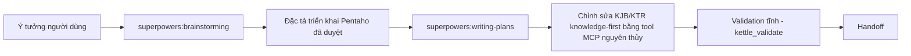

# Hướng dẫn workflow idea-to-static-job

Playbook end-to-end cho operator và agent: biến một ý tưởng thành các artifact `.kjb`/`.ktr` đã validate tĩnh. Suy luận (brainstorm, duyệt thiết kế, đặc tả, lập kế hoạch) do **Superpowers** đảm nhận bên ngoài MCP; các tool MCP nguyên thủy làm phần domain deterministic (tra tri thức, tạo/sửa XML, thao tác graph, validation tĩnh).

Companion skill: `skills/developing-pentaho-jobs/SKILL.md` và mẫu đặc tả `skills/developing-pentaho-jobs/references/pentaho-spec-template.md`. Một agent tương thích Superpowers phát hiện skill trong thư mục `skills/`.

## Nguyên tắc cốt lõi

- **Knowledge-first**: không bao giờ bịa XML Pentaho. Gọi `kettle_knowledge_get(kind, type)` **trước** khi thêm hoặc cấu hình mỗi step/entry type; đọc template, mapping field, default, gotcha.
- **Validation tĩnh là ranh giới hoàn tất**: `kettle_validate` báo zero structural error cho **từng** artifact và cho **toàn cây** đích, cộng một đặc tả đã resolve (không placeholder, không credential literal), nghĩa là "done".
- Thực thi runtime và sinh testcase tự động **nằm ngoài** workflow này, được hoãn và ghi lại như verification theo sau, không thực hiện tại đây.

## Luồng

## Trình tự bắt buộc

1. Đọc trọn `references/pentaho-spec-template.md`.
2. Gọi `superpowers:brainstorming` để làm rõ ý tưởng và đạt thiết kế được duyệt. **Không** mutate artifact nào trước khi thiết kế được duyệt.
3. Viết một đặc tả triển khai Pentaho điền **đủ mọi section** của mẫu, và lấy user duyệt đặc tả đã viết.
4. Sau khi đặc tả được duyệt, gọi `superpowers:writing-plans` để tạo kế hoạch triển khai theo artifact.
5. Với **mỗi** entry/step type khác biệt, gọi `kettle_knowledge_get(kind, type)` trước khi thêm/cấu hình. Kiểm template, mapping field, default, gotcha.
6. Nếu một type thiếu, chỉ ở trạng thái `observed`, hoặc không `generator_eligible` → **dừng** task artifact đó và báo giới hạn catalog chính xác. Không bịa layout XML plugin.
7. Triển khai các `.ktr` lá trước; triển khai `.kjb` điều phối sau cùng. Dùng các edit tool: `kettle_create_file`, `kettle_add_element`, `kettle_set_field`, `kettle_set_field_path`, `kettle_set_fields`, `kettle_edit_hops`, `kettle_add_error_hop`, `kettle_rename_element`, `kettle_clone`. SQL là một `<sql>` field bình thường: đặt bằng `kettle_set_field` với `field: "sql"`.
8. Gọi `kettle_validate` sau mỗi artifact thay đổi, và một lần trên toàn thư mục đích.
9. Kết thúc bằng inventory artifact, bằng chứng validation, mọi warning catalog/manual-review, và ghi rõ verification runtime đã hoãn.

## Hợp đồng đặc tả (specification contract)

Đặc tả là hợp đồng Markdown thuần (không phải `manifest.yaml`, không cần requirement folder hay workflow state). Mọi đường artifact **tương đối workspace** và kết thúc `.kjb`/`.ktr`. Giá trị credential luôn là **biến ngoài**, không bao giờ literal. Mọi quyết định chưa resolve (đánh dấu `TBD`) **chặn** triển khai. Đặc tả gồm sáu section:

1. **Objective and boundaries** — mục tiêu nghiệp vụ, hành vi trong phạm vi, ngoài phạm vi, giả định đã được duyệt.
2. **Artifact inventory** — một dòng mỗi `.kjb`/`.ktr`: path (tương đối workspace), kind, internal name, mục đích, được gọi bởi.
3. **Variables, parameters, and connections** — biến/tham số (tên, type/format, required/default, consumer, nguồn giá trị); connection với credential là biến ngoài (`${DW_HOST}`, `${DW_USER}`, `${DW_PASSWORD}`, …).
4. **Job definitions** — mỗi `.kjb`: bảng job entries (ID, tên, Pentaho type, mục đích, component reference, cấu hình), bảng job hops (from/to/enabled/condition), failure path, completion path.
5. **Transformation definitions** — mỗi `.ktr`: bảng steps (ID, tên, Pentaho type, mục đích, cấu hình, input/output fields), bảng hops (from/to/enabled/error route), error-field contract, SQL contract.
6. **Static acceptance criteria** — mọi artifact tồn tại đúng path; internal name khớp đặc tả; không còn `TBD`/credential literal; mọi type có reference catalog; mọi hop endpoint tồn tại; START/failure/success path có mặt nơi áp dụng; path `.kjb`/`.ktr` được tham chiếu resolve trong workspace; `kettle_validate` zero structural error cho từng artifact và toàn cây.

Đúng đắn dữ liệu nghiệp vụ và thực thi runtime **không** được chứng minh bởi các tiêu chí này.

## Điều cấm trong workflow này

- Không gọi tool runtime (`kettle_runtime_*`) — chúng nằm ngoài workflow và đã hoãn.
- Không sinh testcase, không truy cập database, không deploy artifact.
- Không dùng bề mặt lifecycle BA đã gỡ bỏ (project inspection, workflow state, requirement/design write, generate, sync, validate-project, finalize) — các call này không tồn tại trên bề mặt production.
- Không mutate Git trừ khi user yêu cầu rõ; không ghi credential literal; không đọc/sửa `source_old`.

## Ví dụ end-to-end

Path/ID hư cấu, không bịa payload Pentaho hay business rule.

1. User nêu ý tưởng "export khách hàng hằng ngày ra file".
2. `superpowers:brainstorming` làm rõ và đạt thiết kế được duyệt.
3. Viết đặc tả điền đủ sáu section (ví dụ `etl/load_customer.ktr` + `etl/main.kjb`), user duyệt.
4. `superpowers:writing-plans` tạo kế hoạch theo artifact.
5. Với mỗi type (`TableInput`, `TextFileOutput`, `TRANS`, …): `kettle_knowledge_get` trước; nếu thiếu/observed/không eligible thì dừng và báo.
6. `kettle_create_file` rồi `kettle_add_element`/`kettle_set_field`/`kettle_edit_hops` dựng `.ktr` lá trước, `.kjb` điều phối sau; SQL đặt qua `kettle_set_field` `field: "sql"`.
7. `kettle_validate` sau mỗi artifact và một lần toàn cây → zero structural error.
8. Handoff: inventory, bằng chứng validation, warning catalog/manual-review, note runtime verification đã hoãn.
