# Hướng dẫn workflow phát triển Pentaho (năm pha)

Playbook end-to-end cho operator và agent: biến một BA requirement thành các artifact `.kjb`/`.ktr` đã validate tĩnh, kèm bước verification runtime tùy chọn có kiểm soát. Suy luận (brainstorm, duyệt, đặc tả, lập kế hoạch, thực thi kế hoạch) do **Superpowers** đảm nhận bên ngoài MCP; các tool MCP nguyên thủy làm phần domain deterministic (tra tri thức, tạo/sửa XML, thao tác graph, validation tĩnh, runtime PDI).

Companion skill: `skills/developing-pentaho-jobs/SKILL.md` cùng hai mẫu tham chiếu `references/pentaho-spec-template.md` và `references/pentaho-plan-template.md`.

**Phát hiện skill:** không tự động chỉ vì có thư mục `skills/`. Với **Kiro**, copy `skills/developing-pentaho-jobs/` vào `.kiro/skills/` (workspace) hoặc `~/.kiro/skills/` (user). Với **Codex**/agent tương thích Superpowers, đặt skill dưới thư mục skills của runtime (ví dụ `~/.agents/skills/`) theo tài liệu client.

## Nguyên tắc cốt lõi

- **Cổng mutation kép**: không tool edit MCP nào chạy cho tới khi **cả** đặc tả viết ra **và** kế hoạch triển khai được duyệt rõ ràng. Duyệt thiết kế đơn thuần chỉ mở khóa việc viết đặc tả.
- **Knowledge-first**: không bao giờ bịa XML Pentaho. Gọi `kettle_knowledge_get(kind, type)` **trước** khi thêm hoặc cấu hình mỗi step/entry type; đọc template, mapping field, default, gotcha.
- **Validation tĩnh là ranh giới hoàn tất phần build**: `kettle_validate` báo zero structural error cho **từng** artifact và cho **toàn cây** đích, cộng một đặc tả đã resolve (không placeholder, không credential literal).
- **Runtime phase-gated**: `kettle_runtime_loadcheck` chỉ chạy **sau** validation tĩnh; `kettle_runtime_execute` cần thêm user duyệt riêng cho lần chạy đó, `PENTAHO_HOME` đã dò thấy, và `confirmed: true`. Thất bại runtime không được báo là triển khai thành công.

## Luồng năm pha

```mermaid
flowchart LR
    BA[BA requirement] --> BS[superpowers:brainstorming]
    BS --> Spec[Đặc tả Pentaho đã duyệt]
    Spec --> Plan[superpowers:writing-plans]
    Plan --> Exec[superpowers:executing-plans]
    Exec --> Edit[MCP tạo/sửa KJB/KTR knowledge-first]
    Edit --> Val[Validation tĩnh - kettle_validate]
    Val --> RT[PDI loadcheck/execute tùy chọn, phase-gated]
    RT --> Handoff[Handoff]
```

## Pha 1 — BA requirement và thiết kế

1. Nhận một BA requirement/ticket/tài liệu tự do hoặc requirement đã duyệt.
2. Đọc trọn `references/pentaho-spec-template.md`.
3. Gọi `superpowers:brainstorming`, làm rõ source/target, mapping, biến, connection, orchestration, hành vi lỗi, kỳ vọng restart/idempotency, tiêu chí nghiệm thu.
4. Lấy **duyệt thiết kế** rõ ràng. **Không** mutate artifact nào.
5. Cho phép call MCP **chỉ đọc** để nền tảng quyết định: `kettle_list`, `kettle_summary`, `kettle_get_element`, `kettle_search`, `kettle_knowledge_list`, `kettle_knowledge_get`, `kettle_knowledge_analyze_xml`, `kettle_knowledge_coverage`. Không tool edit/runtime.

## Pha 2 — Đặc tả

1. Viết đặc tả triển khai Pentaho điền **đủ mọi section** của mẫu (objective/boundaries; artifact inventory; variables/parameters/connections; job definitions; transformation definitions; static + runtime acceptance criteria).
2. Đường artifact tương đối workspace; credential là biến ngoài, không literal; không còn `TBD`/quyết định chưa resolve.
3. Lấy **user/BA duyệt** đặc tả đã viết. Vẫn **chưa** mutate artifact — duyệt đặc tả một mình chưa mở khóa edit.

## Pha 3 — Lập kế hoạch

1. Sau khi đặc tả được duyệt, gọi `superpowers:writing-plans`.
2. Kế hoạch theo `references/pentaho-plan-template.md` (kế hoạch theo artifact + call MCP, **không** phải format kế hoạch code/TDD chung).
3. Thứ tự theo artifact: `.ktr` lá trước → `.ktr` phụ thuộc → `.kjb` điều phối cuối → verification toàn cây sau cùng.
4. Mỗi task artifact ghi: path tương đối, kind + internal name, dependency, knowledge lookup, call/intent MCP chính xác, entry/step kỳ vọng + cấu hình, hop thường và hop lỗi, `kettle_validate` focused, kết quả validation kỳ vọng.
5. Lấy **duyệt kế hoạch** rõ ràng. **Không edit/runtime MCP nào trước khi duyệt kế hoạch.** Có cả đặc tả và kế hoạch được duyệt thì cổng mutation mới mở.

## Pha 4 — Triển khai

1. Gọi `superpowers:executing-plans`.
2. Với **mỗi** entry/step type khác biệt, gọi `kettle_knowledge_get(kind, type)` **trước** khi thêm/cấu hình.
3. Nếu một type thiếu, chỉ `observed`, hoặc không `generator_eligible` → **dừng** task đó và báo giới hạn catalog chính xác. Không bịa XML.
4. Triển khai `.ktr` lá trước, `.kjb` điều phối sau. Chỉ dùng các edit tool: `kettle_create_file`, `kettle_add_element`, `kettle_set_field`, `kettle_set_field_path`, `kettle_set_fields`, `kettle_edit_hops`, `kettle_add_error_hop`, `kettle_rename_element`, `kettle_clone`. SQL là một `<sql>` field bình thường: đặt bằng `kettle_set_field` với `field: "sql"`.
5. Gọi `kettle_validate` sau **mỗi** artifact thay đổi. Không lặng lẽ lệch khỏi spec/plan đã duyệt.

## Pha 5 — Verification và cổng runtime

1. Gọi `kettle_validate` trên từng artifact và trên **toàn cây** đích.
2. Hoàn tất tĩnh cần: zero structural error; zero warning (hoặc mỗi warning còn lại được rà và chấp nhận rõ); không marker manual-review chưa giải quyết; inventory khớp đặc tả.
3. **Chỉ sau khi validation tĩnh pass**, các runtime tool khả dụng: `kettle_runtime_detect`, `kettle_runtime_loadcheck`, `kettle_runtime_execute`, `kettle_runtime_logs`.
4. `kettle_runtime_loadcheck` chỉ chạy sau validation tĩnh.
5. `kettle_runtime_execute` cần **đủ**: user duyệt riêng lần chạy đó; `PENTAHO_HOME` cấu hình và dò thấy (`kettle_runtime_detect` báo `available: true`); tham số không chứa credential literal; artifact đã pass validation tĩnh; và `confirmed: true` tại biên gọi.
6. Thất bại runtime (`FAIL`/`TIMEOUT`/`STATIC_VALIDATION_FAILED`/`UNAVAILABLE`) **không** được báo là triển khai thành công.
7. Handoff cuối gồm: inventory artifact; file tạo/sửa; tóm tắt validation từng artifact; tóm tắt validation toàn cây; quyết định warning/manual-review; kết quả loadcheck (nếu chạy); kết quả execute + vị trí log (nếu chạy); và ghi rõ verification runtime đã hoãn khi execute chưa được cấp phép.

## Hợp đồng đặc tả (specification contract)

Đặc tả là hợp đồng Markdown thuần (không phải `manifest.yaml`, không cần requirement folder hay workflow state). Mọi đường artifact **tương đối workspace** và kết thúc `.kjb`/`.ktr`. Giá trị credential luôn là **biến ngoài**, không bao giờ literal. Mọi quyết định chưa resolve (đánh dấu `TBD`) **chặn** triển khai. Đặc tả gồm các section sau (static và runtime acceptance là hai tiêu chí tách biệt):

1. **Objective and boundaries** — mục tiêu nghiệp vụ, hành vi trong phạm vi, ngoài phạm vi, giả định đã được duyệt.
2. **Artifact inventory** — một dòng mỗi `.kjb`/`.ktr`: path (tương đối workspace), kind, internal name, mục đích, được gọi bởi.
3. **Variables, parameters, and connections** — biến/tham số (tên, type/format, required/default, consumer, nguồn giá trị); connection với credential là biến ngoài (`${DW_HOST}`, `${DW_USER}`, `${DW_PASSWORD}`, …).
4. **Job definitions** — mỗi `.kjb`: bảng job entries (ID, tên, Pentaho type, mục đích, component reference, cấu hình), bảng job hops (from/to/enabled/condition), failure path, completion path.
5. **Transformation definitions** — mỗi `.ktr`: bảng steps (ID, tên, Pentaho type, mục đích, cấu hình, input/output fields), bảng hops (from/to/enabled/error route), error-field contract, SQL contract.
6. **Static acceptance criteria** — mọi artifact tồn tại đúng path; internal name khớp đặc tả; không còn `TBD`/credential literal; mọi type có reference catalog; mọi hop endpoint tồn tại; START/failure/success path có mặt nơi áp dụng; path `.kjb`/`.ktr` được tham chiếu resolve trong workspace; `kettle_validate` zero structural error cho từng artifact và toàn cây.
7. **Runtime acceptance criteria** — tùy chọn, phase-gated: kỳ vọng `kettle_runtime_loadcheck` trả `PASS` (sau validation tĩnh); kỳ vọng execute (khi được cấp phép) với tham số ngoài, không credential literal, status kỳ vọng `PASS`; nếu execute không được duyệt thì ghi là verification đã hoãn.

Đúng đắn dữ liệu nghiệp vụ **không** được chứng minh bởi các tiêu chí này. Thực thi runtime là bước verification phase-gated, không phải một phần của static acceptance.

## Điều cấm trong workflow này

- Không chạy tool edit MCP trước khi **cả** đặc tả **và** kế hoạch được duyệt.
- Không chạy tool runtime (`kettle_runtime_*`) trong pha brainstorming/đặc tả/lập kế hoạch/dựng artifact; runtime chỉ mở sau validation tĩnh, và `execute` cần thêm user duyệt.
- Không sinh testcase, không truy cập database, không deploy artifact.
- Không dùng bề mặt lifecycle BA đã gỡ bỏ (project inspection, workflow state, requirement/design write, generate, sync, validate-project, finalize) — các call này không tồn tại trên bề mặt production.
- Không mutate Git trừ khi user yêu cầu rõ; không ghi credential literal; không đọc/sửa `source_old`.

## Ví dụ end-to-end

Path/ID hư cấu, không bịa payload Pentaho hay business rule.

1. BA requirement "export khách hàng hằng ngày ra file".
2. `superpowers:brainstorming` làm rõ và đạt **duyệt thiết kế**.
3. Viết đặc tả điền đủ mọi section (ví dụ `etl/load_customer.ktr` + `etl/main.kjb`) và lấy **duyệt đặc tả**.
4. `superpowers:writing-plans` tạo kế hoạch theo `pentaho-plan-template.md`; lấy **duyệt kế hoạch**. Chỉ khi có cả đặc tả và kế hoạch duyệt, cổng mutation mới mở.
5. `superpowers:executing-plans`: với mỗi type (`TableInput`, `TextFileOutput`, `TRANS`, …) gọi `kettle_knowledge_get` trước; thiếu/observed/không eligible thì dừng và báo.
6. `kettle_create_file` rồi `kettle_add_element`/`kettle_set_field`/`kettle_edit_hops` dựng `.ktr` lá trước, `.kjb` điều phối sau; SQL đặt qua `kettle_set_field` `field: "sql"`.
7. `kettle_validate` sau mỗi artifact và một lần toàn cây → zero structural error.
8. Runtime tùy chọn: sau validation tĩnh, `kettle_runtime_loadcheck`; nếu user duyệt và `PENTAHO_HOME` dò thấy thì `kettle_runtime_execute` với `confirmed: true`.
9. Handoff: inventory, bằng chứng validation từng artifact + toàn cây, warning/manual-review, kết quả loadcheck/execute + vị trí log (nếu chạy), hoặc note runtime verification đã hoãn.
